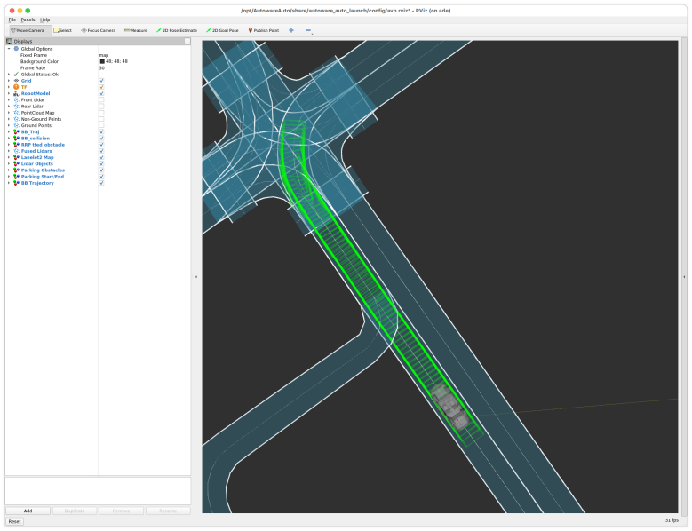

# Run Autoware.Auto and scenario simulator

## Overview

This instruction explains how to run Autoware.Auto on AVA platform and how run scenario simulator and visialization on your host machine.

## Run Autoware.Auto on AVA platform

1. Open terminal window for each module on you host.

1. Access AVA platform via SSH in each terminal window.

1. Find docker image id.

  ```console
  docker image ls
  REPOSITORY                                    TAG                                                           IMAGE ID       CREATED       SIZE
  public.ecr.aws/k7o9k6q7/tier4/autoware.auto   open_ad_kit-autoware-auto-20211111234534-88ea1196cdc0-2zv2o   48a4503b4fe4   11 days ago   6.65GB
  ```

  :speech_balloon: You can find id such as `48a4503b4fe4`.

1. Launch modules.

   :speech_balloon: Replace `48a4503b4fe4` with your docker image id.

   :black_medium_square:__Terminal 1 (map)__

   ```console
   docker run --rm -it --net host -v /home/root/map:/map -v /home/root/cyclonedds:/etc/cyclonedds 48a4503b4fe4 /bin/bash -c "export CYCLONEDDS_URI=file:///etc/cyclonedds/cyclonedds.xml; export RMW_IMPLEMENTATION=rmw_cyclonedds_cpp; source install/setup.bash; ros2 launch scenario_simulator_launch autoware_auto_mapping.launch.py map_path:=/map/kashiwanoha"
   ```

   :black_medium_square:__Terminal 2 (perception)__

   ```console
   docker run --rm -it --net host -v /home/root/cyclonedds:/etc/cyclonedds 48a4503b4fe4 /bin/bash -c "export CYCLONEDDS_URI=file:///etc/cyclonedds/cyclonedds.xml; export RMW_IMPLEMENTATION=rmw_cyclonedds_cpp; source install/setup.bash; ros2 launch scenario_simulator_launch autoware_auto_perception.launch.py"
   ```

   :black_medium_square:__Terminal 3 (planning)__

   ```console
   docker run --rm -it --net host -v /home/root/cyclonedds:/etc/cyclonedds 48a4503b4fe4 /bin/bash -c "export CYCLONEDDS_URI=file:///etc/cyclonedds/cyclonedds.xml; export RMW_IMPLEMENTATION=rmw_cyclonedds_cpp; source install/setup.bash; ros2 launch scenario_simulator_launch autoware_auto_planning.launch.py"
   ```

   :black_medium_square:__Terminal 4 (vehicle)__

   ```console
   docker run --rm -it --net host -v /home/root/cyclonedds:/etc/cyclonedds 48a4503b4fe4 /bin/bash -c "export CYCLONEDDS_URI=file:///etc/cyclonedds/cyclonedds.xml; export RMW_IMPLEMENTATION=rmw_cyclonedds_cpp; source install/setup.bash; ros2 launch autoware_auto_launch autoware_auto_vehicle.launch.py"
   ```

## Run visialization and scenario simulator on your host machine

1. Run Rviz.

   You already cloned Autoware.Auto repository, navigate to the cloned directry.

   1. Launch ADE.

      ```console
      cd ~/adehome/AutowareAuto
      ade --rc .aderc-amd64-foxy-lgsvl start --update --enter
      ```

   1. Launch visialization in ADE.

      ```console
      source /opt/AutowareAuto/setup.bash
      ros2 launch autoware_auto_launch autoware_auto_visualization.launch.py
      ```

1. Find docker image id.

   ```console
   docker image ls
   REPOSITORY                                                                            TAG                                                                           IMAGE ID       CREATED       SIZE
   registry.gitlab.com/autowarefoundation/autoware.auto/autowareauto/amd64/binary-foxy   master                                                                        91512aa9e485   3 days ago    176MB
   registry.gitlab.com/autowarefoundation/autoware.auto/autowareauto/amd64/ade-foxy      master                                                                        0d9978b7113d   4 days ago    5.74GB
   viosfish/scenario_simulator                                                           open_ad_kit-autoware-auto-planning_sim_v2-20211111234534-88ea1196cdc0-2zv2o   d766a256a8c3   11 days ago   5.95GB
   registry.gitlab.com/autowarefoundation/autoware.auto/ade-lgsvl/foxy                   2021.3                                                                        077c172fa5b9   5 weeks ago   379MB

   ```

   :speech_balloon: You can find id such as `d766a256a8c3`.

1. Launch scenario simulator.

   :speech_balloon: Replace `/home/foo` with your home directory.

   :speech_balloon: Replace `d766a256a8c3` with your docker image id.

   ```console
   docker run --rm -it --net host -v /home/foo/scenario:/scenario -v /home/foo/cyclonedds:/etc/cyclonedds d766a256a8c3 /bin/bash -c "export CYCLONEDDS_URI=file:///etc/cyclonedds/cyclonedds.xml; export RMW_IMPLEMENTATION=rmw_cyclonedds_cpp; source install/setup.bash; ros2 launch scenario_test_runner scenario_test_runner.launch.py sensor_model:=aip_xx1 vehicle_model:=lexus launch_autoware:=false architecture_type:=awf/auto scenario:=/scenario/scenario_e3b743e7-110c-4db6-b136-e5ffd5538315_2.yml"
   ```

Now you can see...

:movie_camera: [DEMO Video](images/run-autoware/scenario_e3b743e7-110c-4db6-b136-e5ffd5538315_2.mp4)


