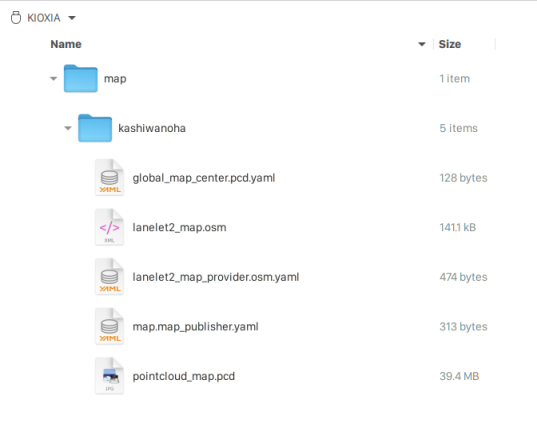
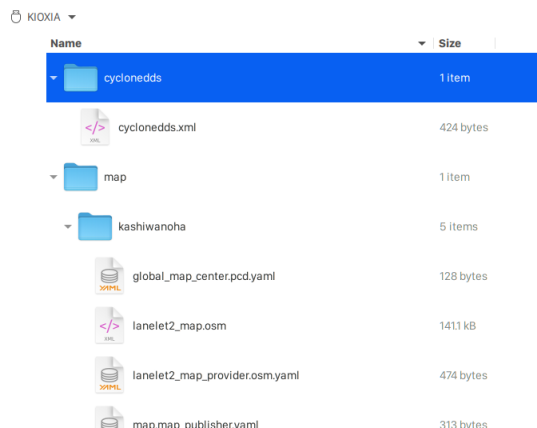

# System Setup on AVA platform

## Overview

This instruction explans how to perform system setup for test execution on AVA platform.

You need to copy docker images and neccesary files.

## Access to AVA platform via SSH

   ```console
   ssh root@IP-ADDRESS
   ```

   For example;

   ```console
   ssh root@192.168.10.27
   ```

## Copy Autoware.Auto image to AVA platform

The docker image of Autoware.Auto is registered in [GitLab Container Registry](https://gitlab.com/autowarefoundation/autoware.auto/AutowareAuto/container_registry/2511358).


1. Copy docker image to AVA platform.

   ```console
   docker pull registry.gitlab.com/autowarefoundation/autoware.auto/autowareauto/arm64/openadkit-foxy:latest
   ```

## Copy neccesary files to USB drive

1. Copy files related to __map contents__.

   Files are placed in the directory :file_folder:[docs/Appendix/Open-AD-Kit-Start-Guide/map](map)

   - :page_facing_up:[lanelet2_map.osm](map/kashiwanoha/lanelet2_map.osm)
   - :page_facing_up:[pointcloud_map.pcd](map/kashiwanoha/pointcloud_map.pcd)
   - :page_facing_up:[global_map_center.pcd.yaml](map/kashiwanoha/global_map_center.pcd.yaml)
   - :page_facing_up:[lanelet2_map_provider.osm.yaml](map/kashiwanoha/lanelet2_map_provider.osm.yaml)
   - :page_facing_up:[map.map_publisher.yaml](map/kashiwanoha/map.map_publisher.yaml)

   Copy files to your USB drive as the following directory structure.

   

1. Copy configuration file of __Cyclone DDS__.

   In this test, we are using Cyclone DDS, so you also need to copy configuration file of Cyclone DDS.

   File is placed in the directory :file_folder:[docs/Appendix/Open-AD-Kit-Start-Guide/cyclonedds](cyclonedds)

   - :page_facing_up:[cyclonedds.xml](cyclonedds/cyclonedds.xml)

   Copy the file to your USB drive as the following directory structure.

   

1. Copy __kernel configuration__ file for tuning kernel parameters.

   We have to reconfigure kernel parameters by using `sysctl` for system stability.

   File is placed in the directory :file_folder:[docs/Appendix/Open-AD-Kit-Start-Guide/sysctl.d](sysctl.d)

   - :page_facing_up:[60_cyclonedds.conf](sysctl.d/60_cyclonedds.conf)

   Copy the file to your USB root.

## Copy files from USB drive to AVA platform

1. Plug your USB drive into AVA platform and copy files

   1. Find USB device name.

      ```console
      lsblk
      NAME        MAJ:MIN RM   SIZE RO TYPE MOUNTPOINT
      sda           8:16   1  28.9G  0 disk 
      `-sda1        8:17   1  28.9G  0 part 
      nvme0n1     259:0    0 119.2G  0 disk 
      |-nvme0n1p1 259:1    0   256M  0 part 
      |-nvme0n1p2 259:2    0   118G  0 part /
      `-nvme0n1p3 259:3    0     1G  0 part 
      ```

   1. Mount USB driver and copy directory.

      ```console
      mkdir -p /mnt/usb
      mount /dev/sda1 /mnt/usb
      cp -r /mnt/usb/* ~/
      ```

   1. Move kernel configuration file to `/etc/sysctl.d`.

      ```console
      mv ~/60_cyclonedds.conf /etc/sysctl.d
      ```

   1. Update kernel parameters.

      ```console
      sysctl -p /etc/sysctl.d/60_cyclonedds.conf
      ```

## Modify `cyclonedds.xml`

You need to change the element `NetworkInterfaceAddress` to the network interface currently in use.

1. Find network interface.

   ```console
   ip addr
   1: lo: <LOOPBACK,UP,LOWER_UP> mtu 65536 qdisc noqueue state UNKNOWN group default qlen 1000
       link/loopback 00:00:00:00:00:00 brd 00:00:00:00:00:00
       inet 127.0.0.1/8 scope host lo
          valid_lft forever preferred_lft forever
       inet6 ::1/128 scope host 
          valid_lft forever preferred_lft forever
    2: enP4p4s0: <BROADCAST,MULTICAST,UP,LOWER_UP> mtu 1500 qdisc mq state UP group default qlen 1000
       link/ether 00:11:22:33:44:55 brd ff:ff:ff:ff:ff:ff
       inet 192.168.10.27/24 brd 192.168.10.255 scope global dynamic enP4p4s0
          valid_lft 332sec preferred_lft 332sec
       inet 192.168.10.13/24 brd 192.168.10.255 scope global secondary dynamic noprefixroute enP4p4s0
          valid_lft 337sec preferred_lft 262sec
       inet6 fe80::34c:b6f7:b356:b7/64 scope link 
          valid_lft forever preferred_lft forever
       inet6 fe80::230:64ff:fe1a:a65/64 scope link 
          valid_lft forever preferred_lft forever
    3: docker0: <NO-CARRIER,BROADCAST,MULTICAST,UP> mtu 1500 qdisc noqueue state DOWN group default 
       link/ether aa:bb:cc:dd:ee:ff brd ff:ff:ff:ff:ff:ff
       inet 172.17.0.1/16 brd 172.17.255.255 scope global docker0
          valid_lft forever preferred_lft forever
   ```

   :speech_balloon: You can find inetwork interface such as `enP4p4s0`.

1. Change the `NetworkInterfaceAddress`.

   ```console
   vi ~/cyclonedds/cyclonedds.xml
   ```

   For example; :page_facing_up: cyclonedds.xml

   ```diff
    <General>
   -  <NetworkInterfaceAddress>lo</NetworkInterfaceAddress>
   +  <NetworkInterfaceAddress>enP4p4s0</NetworkInterfaceAddress>
    </General>
   
   ```

## Shell script for automatic setting up

For above steps, we can use a shell script `openad_target_install_pkgs.sh` to copy docker image and
download dependency files in one go.

   ```console
   #!/bin/bash

   if [[ $# -eq 0 ]] ; then
   	DOCKER_IMAGE_TAG="latest"
   elif [[ $# -eq 1 ]] ; then
   	DOCKER_IMAGE_TAG=$1
   else
   	echo "Usage: ./openad_target_install_pkgs.sh (download the latest OpenAD kit by default)"
   	echo "    or ./openad_target_install_pkgs.sh docker_image_tag (with specified OpenAD tag)"
   	exit 1
   fi

   # Copy docker image to AVA platform.
   echo "Install docker image ..."
   docker pull registry.gitlab.com/autowarefoundation/autoware.auto/autowareauto/arm64/openadkit-foxy:$DOCKER_IMAGE_TAG
   if [ $? != 0 ]; then
   	echo "Failed to download docker image with tag $DOCKER_IMAGE_TAG"
   	exit 1
   fi

   # Copy files related to map contents.
   echo "Copy map files ..."
   mkdir -p ~/map/kashiwanoha
   pushd ~/map/kashiwanoha
   wget https://raw.githubusercontent.com/autowarefoundation/autoware_reference_design/main/docs/Appendix/Open-AD-Kit-Start-Guide/map/kashiwanoha/global_map_center.pcd.yaml
   wget https://raw.githubusercontent.com/autowarefoundation/autoware_reference_design/main/docs/Appendix/Open-AD-Kit-Start-Guide/map/kashiwanoha/lanelet2_map.osm
   wget https://raw.githubusercontent.com/autowarefoundation/autoware_reference_design/main/docs/Appendix/Open-AD-Kit-Start-Guide/map/kashiwanoha/lanelet2_map_provider.osm.yaml
   wget https://raw.githubusercontent.com/autowarefoundation/autoware_reference_design/main/docs/Appendix/Open-AD-Kit-Start-Guide/map/kashiwanoha/map.map_publisher.yaml
   wget https://github.com/autowarefoundation/autoware_reference_design/raw/main/docs/Appendix/Open-AD-Kit-Start-Guide/map/kashiwanoha/pointcloud_map.pcd
   popd

   # Copy configuration file of Cyclone DDS.
   echo "Copy Cyclone DDS ..."
   mkdir -p ~/cyclonedds
   pushd ~/cyclonedds
   wget https://raw.githubusercontent.com/autowarefoundation/autoware_reference_design/main/docs/Appendix/Open-AD-Kit-Start-Guide/cyclonedds/cyclonedds.xml
   network_card=$(ip addr | grep BROADCAST | head -1 | awk -F': ' '{print $2}'); echo $network_card;
   sed -i "s/>lo</>$network_card</g" cyclonedds.xml
   popd

   # Copy kernel configuration file for tuning kernel parameters
   echo "Setup kernel configuration ..."
   wget https://raw.githubusercontent.com/autowarefoundation/autoware_reference_design/main/docs/Appendix/Open-AD-Kit-Start-Guide/sysctl.d/60_cyclonedds.conf
   # Update kernel parameters
   mv ~/60_cyclonedds.conf /etc/sysctl.d/
   sysctl -p /etc/sysctl.d/60_cyclonedds.conf
   ```
